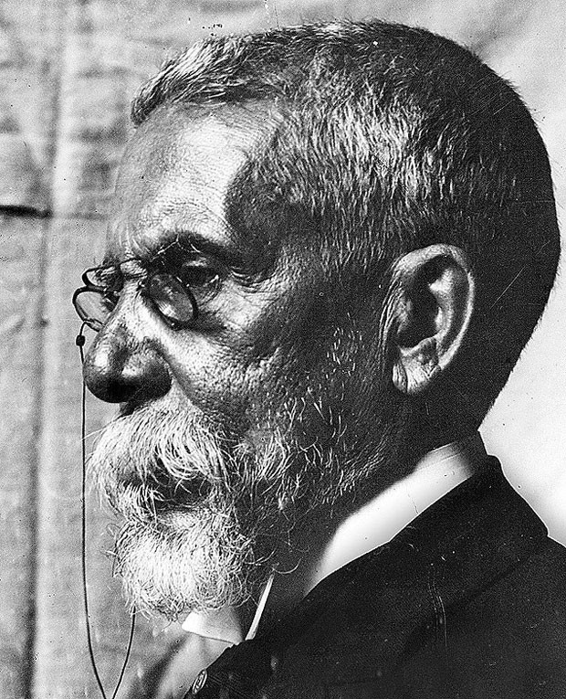
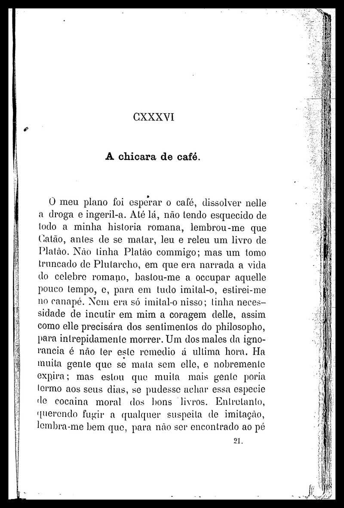
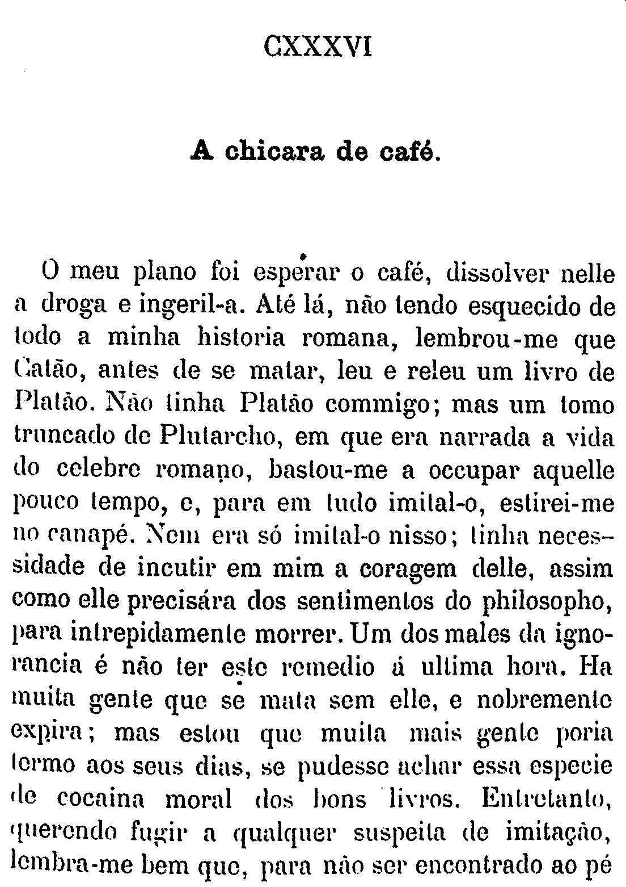

```{r setup, include=FALSE}
knitr::opts_chunk$set(echo = TRUE, message=F, fig.align='center')
```

```{r, message=F}
library(tidyverse)
library(tesseract)
library(magick)
library(wordcloud)
library(tidytext)
library(stm)
library(drlib)
library(kableExtra)
library(htmlwidgets)
```


```{r, fig.cap="Machado de Assis"}

```


# OCR

Utilizando a biblioteca `tesseract` para extrair o texto de uma imagem.
Verificando quais línguas estão disponíveis. Precisamos de português, se não estiver instalado, rodar `tesseract_download("por")`.

```{r}
#tesseract_download("por")
tesseract_info()$available

```

Vamos utilizar está página de Dom Casmurro:

```{r}

```

Primeiramente, cropamos o texto e aumentamos o contraste para melhorar o processamento:

```{r}

```


Utilizando a biblioteca `magick` para melhorar a imagem para processamento, obtemos o seguinte resultado após utilizar o `tesseract()`:

```{r}
texto_crop <- image_read("dom_casmurro_crop2.png") %>%
  image_resize("2000x") %>%
  image_convert(type = 'Grayscale') %>%
  image_trim(fuzz = 40) %>%
  image_write(format = 'png', density = '300x300')  %>%
  ocr(engine=tesseract("por"))

cat(texto_crop)
```

# Palavras Mais Frequentes

Para as próximas seções, utilizaremos 5 romances de Machado de Assis em formato `.txt`: 
  
* Dom Casmurro  
* Memórias Póstumas de Brás Cubas  
* Quincas Borba  
* Esaú e Jacob  
* A Mão e a Luva  


```{r}


livros <- c(Dom_Casmurro = "livros/casmurro.txt", 
            Memorias_Postumas="livros/braz.txt",
            Quincas_Borba = "livros/quincas.txt",
            Esau_Jacob = "livros/esau.txt",
            Mao_E_A_Luva = "livros/mao_luva.txt")

 


df_livros_raw <- names(livros) %>% map_dfr(~{
  text_lines <- read_file(livros[.x]) %>%
    str_remove_all(fixed("\r")) %>%
    str_split("\n") %>%
    as_vector()
    
  tibble(livro=.x, texto=text_lines)
})

# df_livros_raw%>%
#   filter(livro=="Mao_E_A_Luva") %>%
#   filter(str_detect(texto, "Mrs"))
```

## Stopwords
Stopwords são palavras que não carregam conteúdo, como preposições e artigos. Em geral é útil removê-las para a ánalise textual. Aqui vemos alguns exemplos de stopwords:

```{r}
df_stopwords_pt <- read_csv("stopwords_pt.txt", col_names = F) %>%
  rename(word=X1)
df_stopwords_pt %>% 
  head(10) %>%
  knitr::kable() %>% 
  kable_styling(bootstrap_options = c("striped", "hover"), full_width=F)
```


Removendo stopwords e numerações em algarismos romanos (que indicam o número do capítulo)

```{r}

romanos <- c(as.character(utils::as.roman(1:200)),paste0(as.character(utils::as.roman(1:200)),"."))


df_livros_clean <- df_livros_raw %>% 
  filter(!(texto %in% romanos) & texto!="") %>%
  mutate(line = row_number()) %>%
  unnest_tokens(word, texto) %>%
  anti_join(df_stopwords_pt) 
```


Exibindo as palavras mais frequentes presentes em Dom Casmurro

```{r}

df_livros_clean %>%
  filter(livro=="Dom_Casmurro") %>%
  count(word, sort=T) %>%
  head(8) %>%
  mutate(word=fct_inorder(word)%>%fct_rev()) %>%
  ggplot(aes(word,n, fill=word)) +
  geom_col() +
  theme_minimal() + 
  coord_flip() +
  theme(legend.position="none") +
  labs(title="Palavras Mais Frequentes em Dom Casmurro", y="frequência", x="palavra")


```


# Word Cloud {.tabset .tabset-pills}

Podemos exibir a frequência de palavras utilizando uma wordcloud:

## Dom Casmurro {-}

```{r}


#pal <- RColorBrewer::brewer.pal(8,"Dark2")

dom_casmurro <- df_livros_clean %>%
  filter(livro=="Dom_Casmurro") %>%
  count(word, sort=T) %>%
  head(100) %>%
  wordcloud2::wordcloud2(size=2.5)
#with(wordcloud(word, n, random.order = FALSE, max.words = 50, colors=pal))


saveWidget(dom_casmurro,"dom_casmurro_cloud.html",selfcontained = F)
webshot::webshot("dom_casmurro_cloud.html","dom_casmurro_cloud.png",vwidth = 1992, vheight = 1744, delay =10)

```

## Memórias Póstumas {-}

```{r}

memorias_postumas <- df_livros_clean %>%
  filter(livro=="Memorias_Postumas") %>%
  count(word, sort=T) %>%
  head(100) %>%
  wordcloud2::wordcloud2(size=2)
#with(wordcloud(word, n, random.order = FALSE, max.words = 50, colors=pal))


saveWidget(memorias_postumas,"memorias_postumas_cloud.html",selfcontained = F)
webshot::webshot("memorias_postumas_cloud.html","memorias_postumas_cloud.png",
                 vwidth = 1992, vheight = 1744, delay =10)
```


## Quincas Borba {-}

```{r}

quincas <- df_livros_clean %>%
  filter(livro=="Quincas_Borba") %>%
  count(word, sort=T) %>%
  head(100) %>%
  wordcloud2::wordcloud2(size=2.5)
#with(wordcloud(word, n, random.order = FALSE, max.words = 50, colors=pal))

saveWidget(quincas,"quincas_cloud.html",selfcontained = F)
webshot::webshot("quincas_cloud.html","quincas_cloud.png",vwidth = 1992, vheight = 1744, delay =10)
```


## Esaú e Jacob {-}

```{r}

esau_jacob <- df_livros_clean %>%
  filter(livro=="Esau_Jacob") %>%
  count(word, sort=T) %>%
  head(300) %>%
  wordcloud2::wordcloud2(size=1.5)
#with(wordcloud(word, n, random.order = FALSE, max.words = 50, colors=pal))


saveWidget(esau_jacob,"esau_jacob_cloud.html",selfcontained = F)
webshot::webshot("esau_jacob_cloud.html","esau_jacob_cloud.png",vwidth = 1992, vheight = 1744, delay =10)
```


## A Mão e a Luva {-}

```{r}

mao_luva <- df_livros_clean %>%
  filter(livro=="Mao_E_A_Luva") %>%
  count(word, sort=T) %>%
  head(100) %>%
  wordcloud2::wordcloud2(size=2.5)
#with(wordcloud(word, n, random.order = FALSE, max.words = 50, colors=pal))

saveWidget(mao_luva,"mao_luva_cloud.html",selfcontained = F)
webshot::webshot("mao_luva_cloud.html","mao_luva_cloud.png",vwidth = 1992, vheight = 1744, delay =10)
```

# TF-IDF

Uma métrica utilizada em processamento de texto é o tf-idf (term frequence - inverse document frequence). Esta métrica leva em conta a frequência de um termo em um livro (document) comparada à frequência deste termo em outros livros:

```{r}


machado_tf_idf <- df_livros_clean %>%
    count(livro, word, sort = TRUE) %>%
    bind_tf_idf(word, livro, n) %>%
    arrange(-tf_idf) %>%
    group_by(livro) %>%
    top_n(10) %>%
    ungroup

machado_tf_idf %>%
  mutate(word = reorder_within(word, tf_idf, livro)) %>%
  ggplot(aes(word, tf_idf*1000, fill = livro)) +
  geom_col(alpha = 0.8, show.legend = FALSE) +
  facet_wrap(~ livro, scales = "free", ncol = 3,
             labeller=labeller(livro=c(Dom_Casmurro="Dom Casmurro",
                                       Esau_Jacob="Esaú e Jacob",
                                       Mao_E_A_Luva="A Mão e a Luva",
                                       Memorias_Postumas="Memórias Póstumas",
                                       Quincas_Borba="Quincas Borba"))) +
  scale_x_reordered() +
  coord_flip() +
    theme(strip.text=element_text(size=11)) +
  labs(x = NULL,  y="tf-idf x1000",
       title = "Maiores tf-idf nos Romances de Machado de Assis")
```


# Topic Modeling

Fazendo uma análise de tópicos:


## Capítulos de Dom Casmurro (4 tópicos)


```{r}
df_casmurro <- df_livros_raw%>%filter(livro=="Dom_Casmurro")%>%mutate(row=row_number())

chptr_start <- df_casmurro %>%
  filter(texto%in%romanos) %>%
  pull(row)

chptr_start <- c(chptr_start, nrow(df_casmurro))

df_casmurro_cap <- 1:(length(chptr_start)-1) %>% map_dfr(~{
   df_casmurro %>%
     slice(chptr_start[.x]:(chptr_start[(.x+1)]-1)) %>%
     mutate(capitulo=str_c("Capítulo ", .x))
  
})


df_casmurro_clean <- df_casmurro_cap %>%
  select(-row) %>%
  filter(!(texto %in% romanos) & texto!="") %>%
  mutate(line = row_number()) %>%
  unnest_tokens(word, texto) %>%
  anti_join(df_stopwords_pt) 

```

```{r topic-modeling-chptr, cache=T}
dfm_word_freq_casmurro <- df_casmurro_clean  %>%
  count(capitulo, word, sort=T) %>%
  cast_dfm(capitulo, word, n)

# atenção: muito demorado!
topic_model_casmurro <- stm(dfm_word_freq_casmurro, K = 4, 
                            verbose = FALSE, init.type = "Spectral")

```


Palavras associadas aos 4 tópicos:

```{r, fig.height=6}
td_beta <- tidy(topic_model_casmurro)

td_beta %>%
    group_by(topic) %>%
    top_n(10, beta) %>%
    ungroup() %>%
    mutate(topic = paste0("Topic ", topic),
           term = reorder_within(term, beta, topic)) %>%
    ggplot(aes(term, beta, fill = as.factor(topic))) +
    geom_col(alpha = 0.8, show.legend = FALSE) +
    facet_wrap(~ topic, scales = "free_y", ncol=2) +
    coord_flip() +
    scale_x_reordered() +
    labs(x = NULL, y = expression(beta),
         title = "Maiores probabilidades de palavras por tópico")
```


