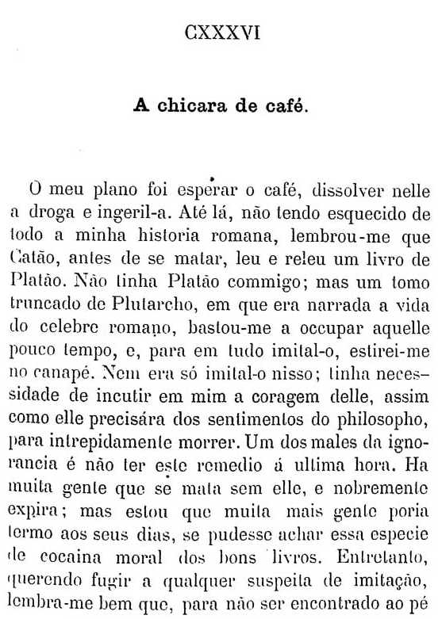

```{r setup, include=FALSE}
knitr::opts_chunk$set(echo = TRUE, message=F, fig.align='center')
```

```{r, message=F}
library(tidyverse)
library(tesseract)
library(magick)
library(wordcloud)
library(tidytext)
library(stm)
library(drlib)
```

# OCR

Utilizando a biblioteca `tesseract` para extrair o texto de uma imagem.
Verificando quais línguas estão disponíveis. Precisamos de português, se não estiver instalado, rodar `tesseract_download("por")`.

```{r}
#tesseract_download("por")
tesseract_info()$available

```

Vamos utilizar está página de Dom Casmurro:

```{r}

```

Primeiramente, cropamos o texto para melhorar o processamento:

```{r}

```


Utilizando a biblioteca `magick` para melhorar a imagem para processamento:

```{r}
texto_crop <- image_read("dom_casmurro_crop2.png") %>%
  image_resize("2000x") %>%
  image_convert(type = 'Grayscale') %>%
  image_trim(fuzz = 40) %>%
  image_write(format = 'png', density = '300x300')  %>%
  ocr(engine=tesseract("por"))

cat(texto_crop)
```

# Palavras Mais Frequentes

Para as próximas seções, utilizaremos 5 romances de Machado de Assis em formato `.txt`: 
  
* Dom Casmurro  
* Memórias Póstumas de Brás Cubas  
* Quincas Borba  
* Esaú e Jacob  
* A Mão e a Luva  


```{r}


livros <- c(Dom_Casmurro = "livros/casmurro.txt", 
            Memorias_Postumas="livros/braz.txt",
            Quincas_Borba = "livros/quincas.txt",
            Esau_Jacob = "livros/esau.txt",
            Mao_E_A_Luva = "livros/mao_luva.txt")

 


df_livros_raw <- names(livros) %>% map_dfr(~{
  text_lines <- read_file(livros[.x]) %>%
    str_remove_all(fixed("\r")) %>%
    str_split("\n") %>%
    as_vector()
    
  tibble(livro=.x, texto=text_lines)
})

# df_livros_raw%>%
#   filter(livro=="Mao_E_A_Luva") %>%
#   filter(str_detect(texto, "Mrs"))
```


Removendo stopwords e numerações em algarismos romanos (que indicam o número do capítulo)

```{r}

romanos <- c(as.character(utils::as.roman(1:200)),paste0(as.character(utils::as.roman(1:200)),"."))

df_stopwords_pt <- read_csv("stopwords_pt.txt", col_names = F) %>%
  rename(word=X1)


df_livros_clean <- df_livros_raw %>% 
  filter(!(texto %in% romanos) & texto!="") %>%
  mutate(line = row_number()) %>%
  unnest_tokens(word, texto) %>%
  anti_join(df_stopwords_pt) 
```


Exibindo as palavras mais frequentes presentes em Dom Casmurro

```{r}

df_livros_clean %>%
  filter(livro=="Dom_Casmurro") %>%
  count(word, sort=T) %>%
  head(8) %>%
  mutate(word=fct_inorder(word)%>%fct_rev()) %>%
  ggplot(aes(word,n, fill=word)) +
  geom_col() +
  theme_minimal() + 
  coord_flip() +
  theme(legend.position="none") +
  labs(title="Palavras Mais Frequentes em Dom Casmurro", y="frequência", x="palavra")


```


# Word Cloud

Podemos exibir a frequência de palavras utilizando uma wordcloud:

```{r}


## tentativa de facet: pesquisar mais

# 
# wordclouds <- df_livros_clean$livro%>%unique() %>% map(~{
#   df_livros_clean %>%
#     filter(livro==.x) %>%
#     count(word, sort=T) %>%
#     with(wordcloud(word, n, random.order = FALSE, max.words = 40, colors=pal))
#   
# })
# 
#   df_livros_clean %>%
#     filter(livro=="Esau_Jacob") %>%
#     count(word, sort=T) %>%
#  with(wordcloud(word, n, random.order = FALSE, max.words = 40, colors=pal))
# 
# grid.arrange(wordclouds)
# 
# 
# df_livros_clean %>%
#   count(livro, word, sort=T) %>%
#   group_by(livro) %>%
#   top_n(15, n) %>%
#   mutate(angle = 90 * sample(c(0, 1), n(), replace = TRUE, prob = c(60, 40))) %>%
#   ungroup() %>%
#   ggplot(aes(
#     label = word, size = n,
#     #color = factor(sample.int(10, nrow(df_livros_clean%>%count(livro, word, sort=T)), replace = TRUE)),
#     angle = angle
#   )) +
#   geom_text_wordcloud_area() +
#   scale_size_area(max_size = 24) +
#   theme_minimal() +
#   facet_wrap(~livro)


pal <- RColorBrewer::brewer.pal(8,"Dark2")
df_livros_clean %>%
  filter(livro=="Dom_Casmurro") %>%
  count(word, sort=T) %>%
with(wordcloud(word, n, random.order = FALSE, max.words = 50, colors=pal))


```

# TF-IDF

Uma métrica utilizada em processamento de texto é o tf-idf (term frequence - inverse document frequence). Esta métrica leva em conta a frequência de um termo em um livro (document) comparada à frequência deste termo em outros livros:

```{r}


machado_tf_idf <- df_livros_clean %>%
    count(livro, word, sort = TRUE) %>%
    bind_tf_idf(word, livro, n) %>%
    arrange(-tf_idf) %>%
    group_by(livro) %>%
    top_n(10) %>%
    ungroup

machado_tf_idf %>%
  mutate(word = reorder_within(word, tf_idf, livro)) %>%
  ggplot(aes(word, tf_idf*1000, fill = livro)) +
  geom_col(alpha = 0.8, show.legend = FALSE) +
  facet_wrap(~ livro, scales = "free", ncol = 3,
             labeller=labeller(livro=c(Dom_Casmurro="Dom Casmurro",
                                       Esau_Jacob="Esaú e Jacob",
                                       Mao_E_A_Luva="A Mão e a Luva",
                                       Memorias_Postumas="Memórias Póstumas",
                                       Quincas_Borba="Quincas Borba"))) +
  scale_x_reordered() +
  coord_flip() +
    theme(strip.text=element_text(size=11)) +
  labs(x = NULL,  y="tf-idf x1000",
       title = "Maiores tf-idf nos Romances de Machado de Assis")
```


# Topic Modeling

Fazendo uma análise de tópicos:

```{r topic-modeling, cache=T}

dfm_word_freq <- df_livros_clean  %>%
  count(livro, word, sort=T) %>%
    cast_dfm(livro, word, n)

# atenção: muito demorado!
topic_model <- stm(dfm_word_freq, K = 4, 
                   verbose = FALSE, init.type = "Spectral")
```

Palavras associadas aos 4 tópicos:

```{r}
td_beta <- tidy(topic_model)

td_beta %>%
    group_by(topic) %>%
    top_n(10, beta) %>%
    ungroup() %>%
    mutate(topic = paste0("Topic ", topic),
           term = reorder_within(term, beta, topic)) %>%
    ggplot(aes(term, beta, fill = as.factor(topic))) +
    geom_col(alpha = 0.8, show.legend = FALSE) +
    facet_wrap(~ topic, scales = "free_y") +
    coord_flip() +
    scale_x_reordered() +
    labs(x = NULL, y = expression(beta),
         title = "Maiores probabilidades de palavras por tópico")
```


Distribuição de tópicos por livros

```{r}
td_gamma <- tidy(topic_model, matrix = "gamma",                    
                 document_names = rownames(dfm_word_freq))

ggplot(td_gamma, aes(gamma, fill = as.factor(topic))) +
  geom_histogram(alpha = 0.8, show.legend = FALSE) +
  facet_wrap(~ topic, ncol = 2) +
  labs(title = "Distribuição de probabilidade de documento para cada tópico",
       subtitle = "Cada tópico é associado a 1-2 palavras",
       y = "Número de Livros", x = expression(gamma)) 

```


